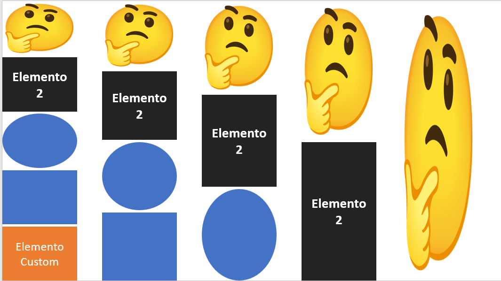
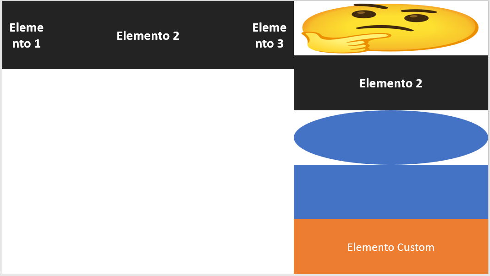
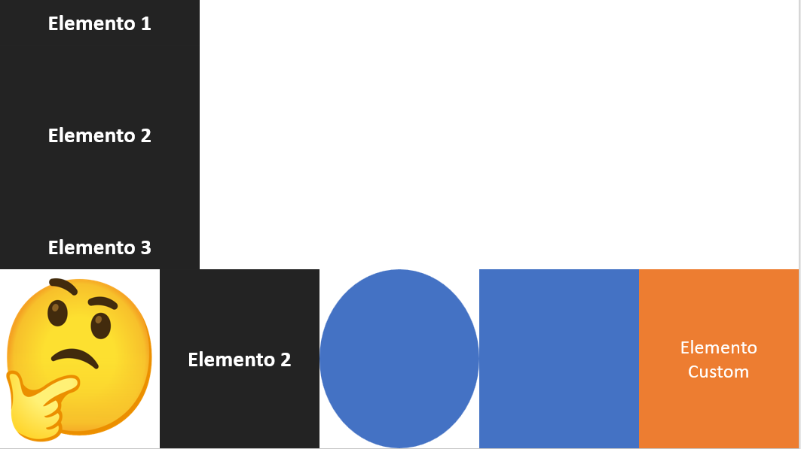

# Utilidades para pptxgen

## AddRowOfElements()

La función `addRowOfElements` es una función de utilidad que permite agregar una fila de elementos a una diapositiva. Los elementos pueden ser imágenes, texto, formas o elementos personalizados. La función distribuye uniformemente el ancho de la fila entre los elementos.

La función toma un objeto de opciones como parámetro, que incluye:

- `slide`: La diapositiva a la que se agregarán los elementos.
- `pageSize`: El tamaño de la página, que incluye el ancho y la altura.
- `elements`: Un array de los elementos que se agregarán a la fila. Cada elemento es un objeto que incluye el tipo de elemento (`image`, `text`, `shape`, `custom`) y las opciones específicas del elemento.
- `y`: La coordenada y de la fila. Por defecto es 0.
- `customheight`: La altura personalizada de los elementos. Por defecto es 0.
- `gap`: El espacio entre los elementos. Por defecto es 0.

La función calcula el ancho de cada columna en la fila y luego itera sobre los elementos, agregándolos a la diapositiva en la posición correcta y con el ancho correcto. Para los elementos personalizados, la función llama a la función del elemento con la diapositiva, el tamaño de la página, la posición y el tamaño del elemento como argumentos.

Finalmente, la función devuelve un objeto que contiene la diapositiva actualizada, el ancho de la columna y las posiciones de los elementos.

  

Con elementos personalizados:

  

## addColumnOfElements()

La función `addColumnOfElements` es una función de utilidad que permite agregar una columna de elementos a una diapositiva. Los elementos pueden ser imágenes, texto, formas o elementos personalizados. La función distribuye uniformemente el alto de la columna entre los elementos.

La función toma un objeto de opciones como parámetro, que incluye:

- `slide`: La diapositiva a la que se agregarán los elementos.
- `pageSize`: El tamaño de la página, que incluye el ancho y la altura.
- `elements`: Un array de los elementos que se agregarán a la columna. Cada elemento es un objeto que incluye el tipo de elemento (`image`, `text`, `shape`, `custom`) y las opciones específicas del elemento.
- `x`: La posición x de los elementos. Por defecto es 0.
- `customwidth`: El ancho personalizado de los elementos. Por defecto es 0.
- `gapPercent`: El porcentaje de espacio entre los elementos. Por defecto es "0%".

La función calcula la altura de cada fila en la columna y luego itera sobre los elementos, agregándolos a la diapositiva en la posición correcta y con la altura correcta. Para los elementos personalizados, la función llama a la función del elemento con la diapositiva, el tamaño de la página, la posición y el tamaño del elemento como argumentos.

Finalmente, la función devuelve un objeto que contiene la diapositiva actualizada, la altura de la fila y las posiciones de los elementos.

  

## addRowOfElementsWithSizes()

La función `addRowOfElementsWithSizes` es una función de utilidad que permite agregar una fila de elementos a una diapositiva. Los elementos pueden ser imágenes, texto, formas o elementos personalizados. A diferencia de `addRowOfElements`, esta función permite que los elementos tengan tamaños personalizados.

La función toma un objeto de opciones como parámetro, que incluye:

* `slide`: La diapositiva a la que se agregarán los elementos.
* `pageSize`: El tamaño de la página, que incluye el ancho y la altura.
* `elements`: Un array de los elementos que se agregarán a la fila. Cada elemento es un objeto que incluye el tipo de elemento (`image`, `text`, `shape`, `custom`), las opciones específicas del elemento y el ancho y la altura del elemento en porcentaje.
* `y`: La coordenada y de la fila. Por defecto es 0.
* `customheight`: La altura personalizada de los elementos. Por defecto es 0.

La función verifica que el ancho y la altura de la página estén definidos, que el ancho y la altura de los elementos estén en porcentaje, que el ancho de un elemento no sea mayor que 100 y que la suma de los anchos de los elementos sea igual a 100.

Luego, la función itera sobre los elementos, agregándolos a la diapositiva en la posición correcta y con el ancho y la altura correctos. Para los elementos personalizados, la función llama a la función del elemento con la diapositiva, el tamaño de la página, la posición y el tamaño del elemento como argumentos.

Finalmente, la función devuelve un objeto que contiene la diapositiva actualizada y las posiciones de los elementos.

  

## addColumnOfElementsWithSizes()

La función `addColumnOfElementsWithSizes` es una función de utilidad que permite agregar una columna de elementos a una diapositiva. Los elementos pueden ser imágenes, texto, formas o elementos personalizados. A diferencia de `addColumnOfElements`, esta función permite que los elementos tengan tamaños personalizados.

La función toma un objeto de opciones como parámetro, que incluye:

* `slide`: La diapositiva a la que se agregarán los elementos.
* `pageSize`: El tamaño de la página, que incluye el ancho y la altura.
* `elements`: Un array de los elementos que se agregarán a la columna. Cada elemento es un objeto que incluye el tipo de elemento (`image`, `text`, `shape`, `custom`), las opciones específicas del elemento y el ancho y la altura del elemento en porcentaje.
* `x`: La coordenada x de la columna. Por defecto es 0.
* `customwidth`: El ancho personalizado de los elementos. Por defecto es 0.

La función verifica que el ancho y la altura de la página estén definidos, que el ancho y la altura de los elementos estén en porcentaje, que la altura de un elemento no sea mayor que 100 y que la suma de las alturas de los elementos sea igual a 100.

Luego, la función itera sobre los elementos, agregándolos a la diapositiva en la posición correcta y con el ancho y la altura correctos. Para los elementos personalizados, la función llama a la función del elemento con la diapositiva, el tamaño de la página, la posición y el tamaño del elemento como argumentos.

Finalmente, la función devuelve un objeto que contiene la diapositiva actualizada y las posiciones de los elementos.

  

