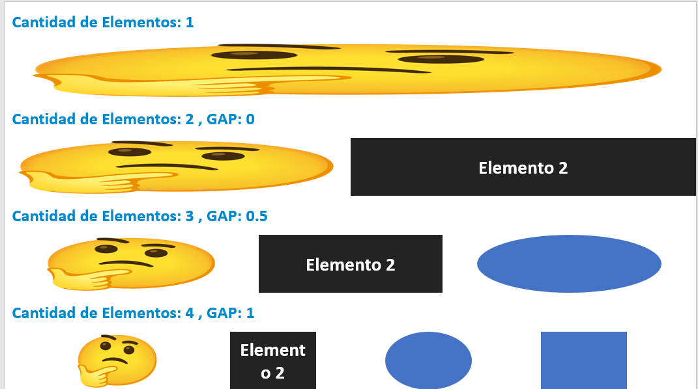

# Utilidades para pptxgen

La función `addRowOfElements` es una función de utilidad que permite agregar una fila de elementos a una diapositiva. Los elementos pueden ser imágenes, texto, formas o elementos personalizados. La función distribuye uniformemente el ancho de la fila entre los elementos.

La función toma un objeto de opciones como parámetro, que incluye:

- `slide`: La diapositiva a la que se agregarán los elementos.
- `pageSize`: El tamaño de la página, que incluye el ancho y la altura.
- `elements`: Un array de los elementos que se agregarán a la fila. Cada elemento es un objeto que incluye el tipo de elemento (`image`, `text`, `shape`, `custom`) y las opciones específicas del elemento.
- `y`: La coordenada y de la fila. Por defecto es 0.
- `customheight`: La altura personalizada de los elementos. Por defecto es 0.
- `gap`: El espacio entre los elementos. Por defecto es 0.

La función calcula el ancho de cada columna en la fila y luego itera sobre los elementos, agregándolos a la diapositiva en la posición correcta y con el ancho correcto. Para los elementos personalizados, la función llama a la función del elemento con la diapositiva, el tamaño de la página, la posición y el tamaño del elemento como argumentos.

Finalmente, la función devuelve un objeto que contiene la diapositiva actualizada, el ancho de la columna y las posiciones de los elementos.

  

